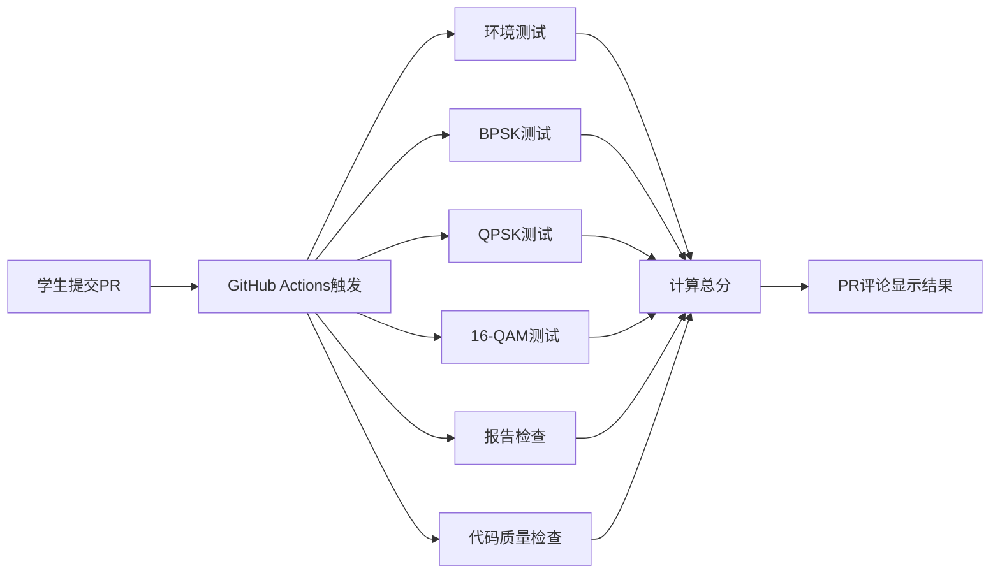

# 数字调制解调实验平台 - 项目说明

## 📋 项目概述

这是一个基于 GitHub + AI 辅助编程的数字调制解调实验平台，用于《通信原理》或《数字通信》课程的实验教学。

**实验时长**：2小时（120分钟）  
**目标学生**：本科生/研究生  
**技术栈**：Python + NumPy + Matplotlib + GitHub Actions + GitHub Copilot

---

## 🎯 教学目标

1. 理解 BPSK、QPSK、16-QAM 调制原理
2. 掌握 Python 科学计算工具（NumPy、Matplotlib）
3. 学习使用 AI 编程助手（GitHub Copilot）
4. 熟悉 GitHub 协作流程和自动评分系统

---

## 📦 仓库结构

```
wireless-modulation-experiment/
├── README.md                    # 学生实验指南
├── TEACHER_GUIDE.md             # 教师使用说明
├── REPORT_TEMPLATE.md           # 实验报告模板
├── requirements.txt             # Python依赖
├── .gitignore                   # Git忽略文件
│
├── .github/workflows/
│   └── grading.yml              # GitHub Actions自动评分
│
├── src/                         # 学生代码区
│   ├── modulation.py            # 调制函数（待实现）
│   ├── demodulation.py          # 解调函数（选做）
│   ├── performance_test.py      # 性能测试（选做）
│   ├── utils.py                 # 工具函数（已实现）
│   └── test_environment.py      # 环境测试脚本
│
├── grading/                     # 自动评分脚本
│   ├── test_bpsk.py             # BPSK单元测试
│   ├── test_qpsk.py             # QPSK单元测试
│   ├── test_qam16.py            # 16-QAM单元测试
│   ├── check_report.py          # 报告检查
│   └── calculate_grade.py       # 总评分计算
│
├── docs/                        # 实验文档
│   ├── theory_bpsk.md           # BPSK原理
│   ├── theory_qpsk.md           # QPSK原理
│   ├── theory_qam.md            # QAM原理
│   ├── copilot_guide.md         # Copilot使用指南
│   └── git_quickstart.md        # Git快速入门
│
├── examples/                    # 示例输出
│   ├── bpsk_constellation.png   # BPSK示例图
│   ├── qpsk_constellation.png   # QPSK示例图
│   ├── 16qam_constellation.png  # 16-QAM示例图
│   ├── ber_curve_example.png    # BER曲线示例
│   └── generate_examples.py     # 生成示例脚本
│
└── results/                     # 学生结果（自动创建）
    └── .gitkeep
```

---

## ✅ 实验任务清单

### 必做任务（75分）

- [ ] **任务0**: 环境配置（5分）
  - 使用 Copilot Agent 或手动安装 Python 环境
  - 运行 `test_environment.py` 验证
  
- [ ] **任务1**: BPSK 调制（25分）
  - 实现 `bpsk_modulate()` 函数
  - 生成星座图并保存
  
- [ ] **任务2**: QPSK 调制（25分）
  - 实现 `qpsk_modulate()` 函数（格雷码）
  - 生成星座图并保存
  
- [ ] **任务3**: 16-QAM 调制（20分）
  - 实现 `qam16_modulate()` 函数
  - 生成星座图并保存

- [ ] **任务6**: 实验报告（15分）
  - 填写 `REPORT.md`
  - 包含原理、方法、结果、分析、心得

### 选做任务（20分加分）

- [ ] **任务4**: 解调实现（10分）
  - `bpsk_demodulate()`
  - `qpsk_demodulate()`
  - `qam16_demodulate()`
  
- [ ] **任务5**: BER 性能分析（10分）
  - 生成 BER vs SNR 曲线
  - 对比不同调制方式

### 代码质量（-10~+5分）

- pylint 评分 ≥ 8.0: +5分
- pylint 评分 5.0~8.0: 0分
- pylint 评分 < 5.0: -10分

---

## 🚀 快速开始

### 教师部署

1. 克隆本仓库到你的 GitHub 账号
2. 设置为模板仓库（Template repository）
3. 配置 GitHub Actions 权限
4. 发布实验通知给学生

### 学生使用

1. Fork 模板仓库到个人账号
2. Clone 到本地
3. 安装依赖：`pip install -r requirements.txt`
4. 完成实验任务
5. Commit & Push
6. 创建 Pull Request
7. 查看自动评分结果

---

## 📊 评分系统

### 自动评分流程



### 评分标准

| 评分项 | 满分 | 评分细则 |
|--------|------|----------|
| 环境配置 | 5 | 成功运行环境测试脚本 |
| BPSK调制 | 25 | 映射正确(15) + 星座图(10) |
| QPSK调制 | 25 | 映射正确(15) + 星座图(10) |
| 16-QAM调制 | 20 | 映射正确(12) + 星座图(8) |
| 实验报告 | 15 | 完整性(8) + 分析深度(7) |
| 代码质量 | -10~+5 | 基于 pylint 评分 |
| 解调实现 | +10 | 选做加分 |
| BER性能 | +10 | 选做加分 |

---

## 🛠️ 技术特性

### GitHub Actions 自动评分

- **自动触发**：学生提交 PR 后 3-5 分钟内完成评分
- **详细反馈**：测试失败时显示具体错误信息
- **可重复评分**：修改代码后重新提交即可重新评分

### AI 辅助编程

- **GitHub Copilot**：学生可使用 AI 助手编写代码
- **教学引导**：提供详细的提示词示例和使用指南
- **平衡学习**：强调理解原理，避免盲目依赖 AI

### 自动化测试

- **单元测试**：pytest 覆盖所有核心功能
- **代码质量**：pylint 检查代码规范
- **报告检查**：自动验证实验报告完整性

---

## 📚 配套文档

### 理论文档

- [BPSK原理](docs/theory_bpsk.md)：二进制相移键控
- [QPSK原理](docs/theory_qpsk.md)：正交相移键控
- [QAM原理](docs/theory_qam.md)：正交幅度调制

### 工具指南

- [Copilot使用指南](docs/copilot_guide.md)：如何有效使用 AI 助手
- [Git快速入门](docs/git_quickstart.md)：Git 基本操作

### 模板文件

- [实验报告模板](REPORT_TEMPLATE.md)：标准报告格式

---

## 🎓 教学建议

### 第一小时（课堂讲解）

1. **介绍实验目标**（5分钟）
2. **演示环境配置**（10分钟）
   - 使用 Copilot Agent 自动安装依赖
3. **讲解调制原理**（20分钟）
   - BPSK、QPSK、16-QAM 原理
   - 星座图概念
4. **演示 BPSK 实现**（15分钟）
   - 使用 Copilot 辅助编写代码
   - 生成星座图
5. **讲解 Git 和 PR 流程**（10分钟）

### 第二小时（学生实验）

1. 学生独立完成 QPSK 和 16-QAM
2. 教师和助教巡回答疑
3. 鼓励学生尝试选做任务
4. 最后 10 分钟：提交代码并创建 PR

---

## 🔧 维护与更新

### 更新实验内容

修改模板仓库的文件后：

```bash
git add .
git commit -m "更新实验要求"
git push origin main
```

学生重新 Fork 或 Pull 即可获取最新版本。

### 调整评分权重

修改 `grading/calculate_grade.py`：

```python
# 调整分值
bpsk_score = 30  # 从25提高到30
qpsk_score = 30  # 从25提高到30
```

### 添加新任务

1. 在 `src/` 中添加新的代码模板
2. 在 `grading/` 中添加对应的测试脚本
3. 更新 `README.md` 和评分系统

---

## 📞 支持与反馈

### 问题报告

如果发现 Bug 或有改进建议：

- 在 GitHub 上提 Issue
- 发送邮件至：[你的邮箱]

### 贡献代码

欢迎提交 Pull Request 改进本平台！

---

## 📄 许可证

本项目采用 MIT 许可证。

---

## 🙏 致谢

感谢以下开源项目：

- [NumPy](https://numpy.org/)
- [Matplotlib](https://matplotlib.org/)
- [pytest](https://pytest.org/)
- [GitHub Actions](https://github.com/features/actions)
- [GitHub Copilot](https://github.com/features/copilot)

---

**版本**：v1.0.0  
**最后更新**：2026年4月21日  
**维护者**：[你的名字]

---

## 📈 统计信息

- **总代码行数**：~3000行
- **文档页数**：~50页
- **测试用例数**：30+个
- **平均完成时间**：90-120分钟

---

**祝实验教学圆满成功！** 🎉
