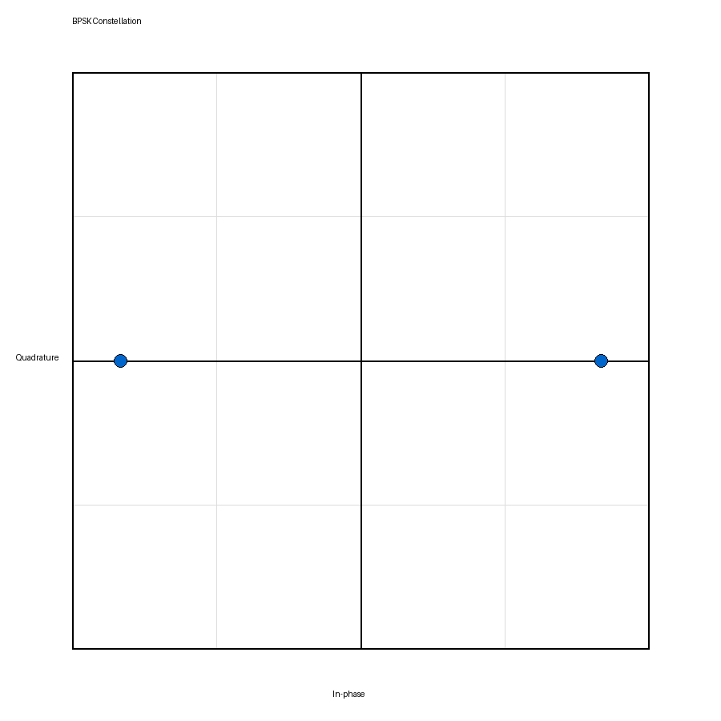
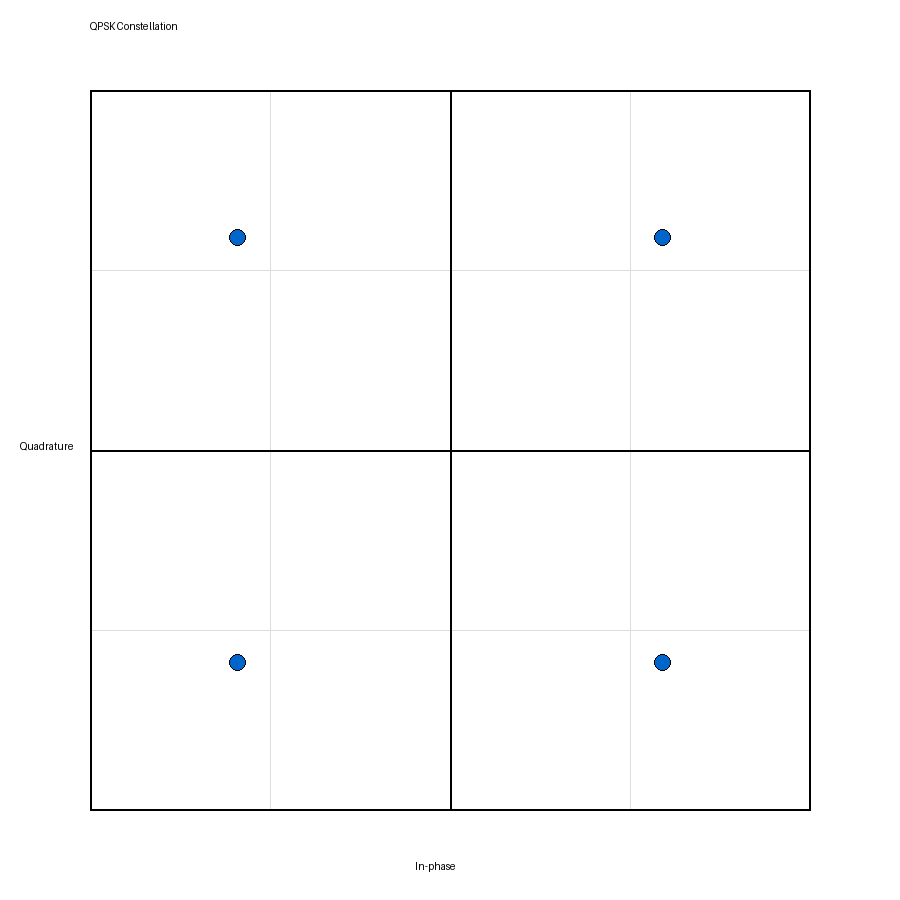
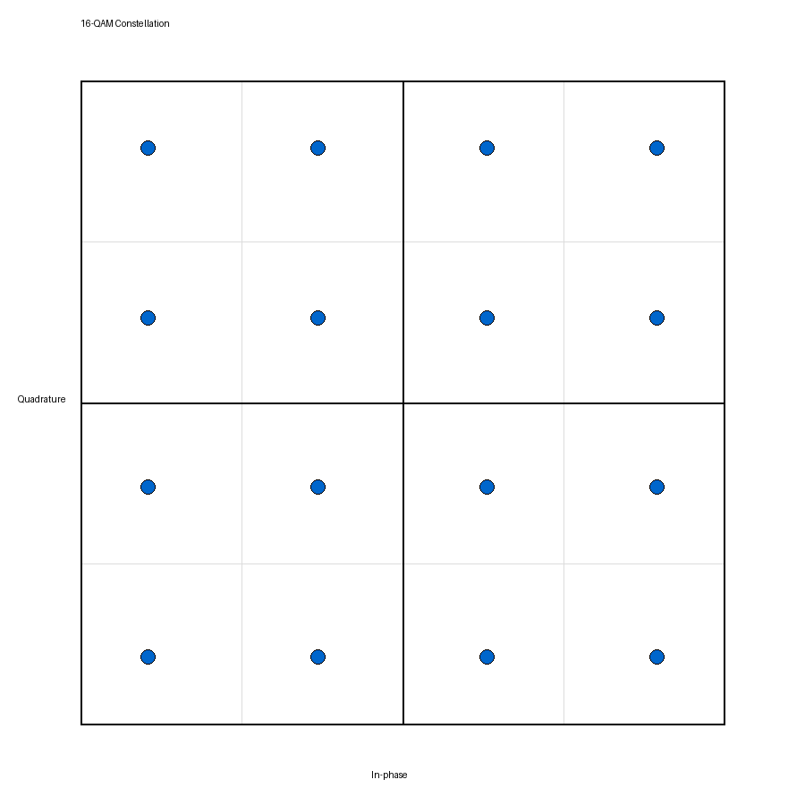
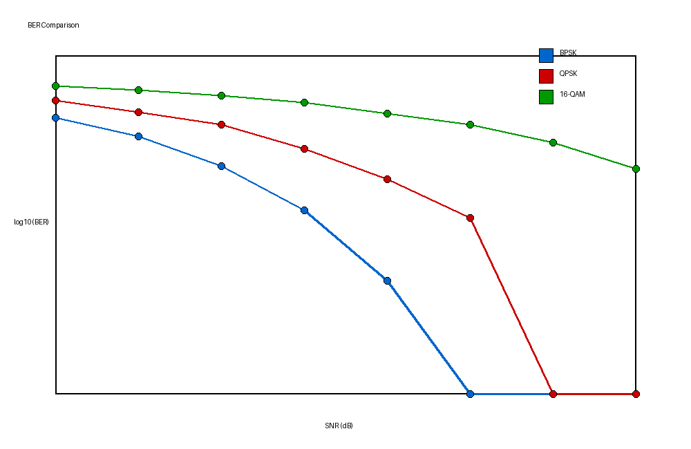
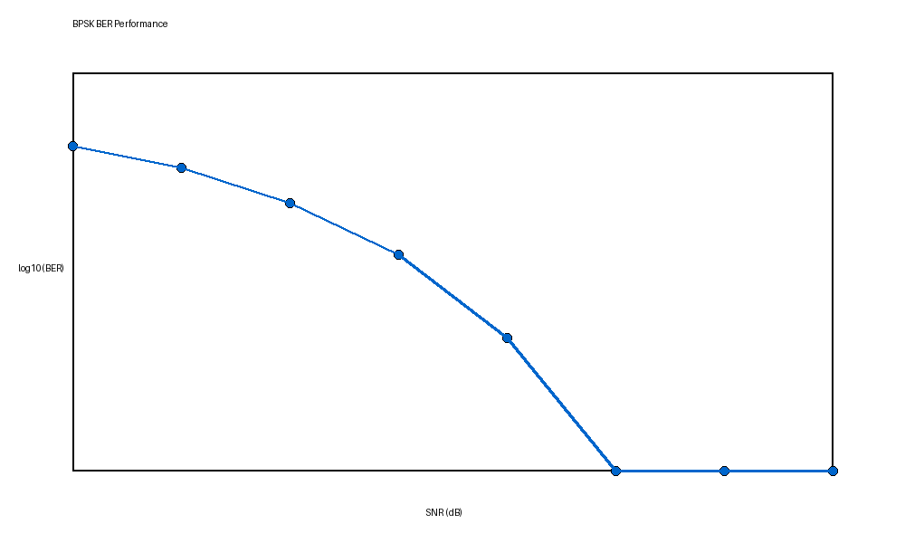
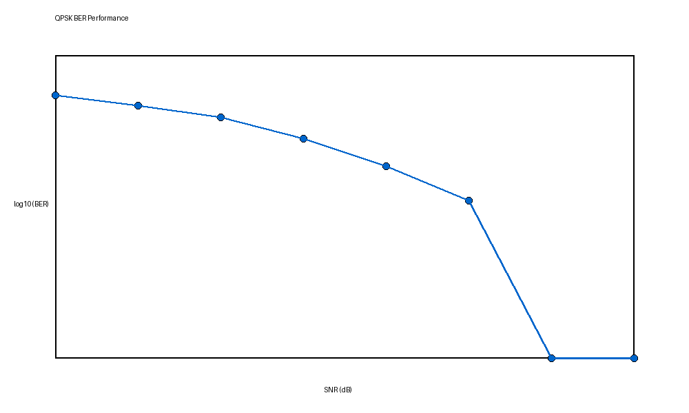
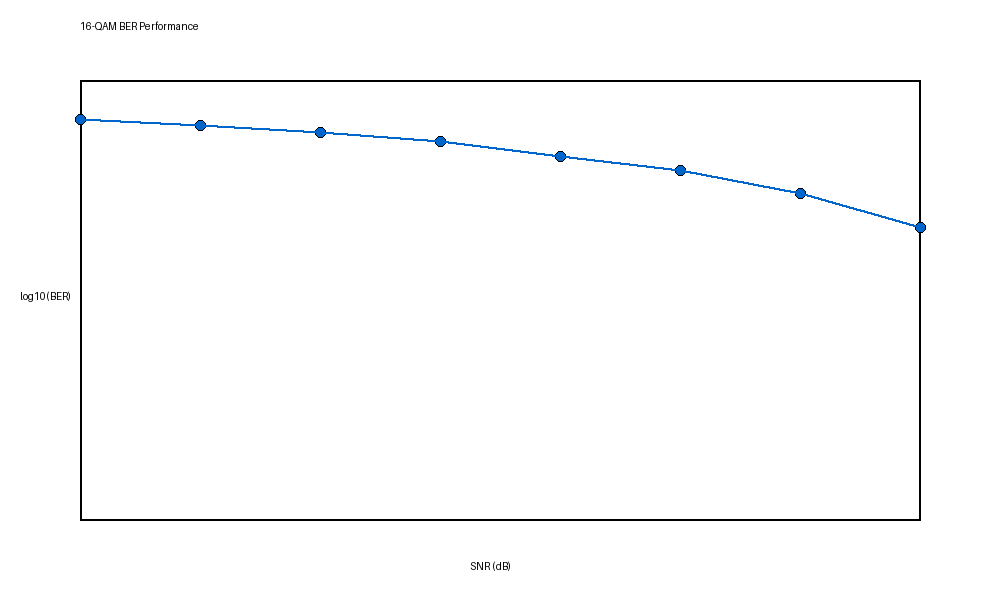

# 数字调制解调实验报告

**实验名称**：数字调制解调实验  
**学生姓名**：谭榆铃  
**学号**：2023280502  
**实验日期**：2026年4月23日  
**提交日期**：2026年4月23日  

---

## 1. 实验目的

本实验的主要目标如下：

- 理解数字调制与解调的基本原理，掌握 BPSK、QPSK 和 16-QAM 的符号映射方式。
- 使用 Python、NumPy 完成调制、解调和误码率分析程序的实现。
- 通过星座图观察不同调制方式的符号分布特征。
- 通过 BER 曲线比较不同调制方式在 AWGN 信道中的抗噪声性能。
- 体验 AI 编程助手在代码生成、调试和完善实验过程中的辅助作用。

---

## 2. 实验原理

### 2.1 BPSK 调制原理

BPSK（Binary Phase Shift Keying，二进制相移键控）每次传输 1 bit 信息，用两个相位相反的符号表示二进制 0 和 1。本实验中采用如下映射：

$$
0 \rightarrow +1,\quad 1 \rightarrow -1
$$

也可以写成：

$$
s = 1 - 2b
$$

其中 $b \in \{0,1\}$。

BPSK 的星座图只有两个点，分布在实轴两端，因此结构最简单、符号间距离最大，抗噪声性能最好，但频谱效率相对较低。

### 2.2 QPSK 调制原理

QPSK（Quadrature Phase Shift Keying，正交相移键控）每个符号表示 2 bit 信息，因此比 BPSK 具有更高的频谱效率。实验中采用格雷码映射：

- `00 -> (1+j)/sqrt(2)`
- `01 -> (-1+j)/sqrt(2)`
- `11 -> (-1-j)/sqrt(2)`
- `10 -> (1-j)/sqrt(2)`

除以 `sqrt(2)` 的目的是使符号平均功率归一化为 1。

QPSK 的星座图有 4 个点，均匀分布在复平面的四个象限上。使用格雷码映射可以减少相邻星座点判错时带来的比特错误数。

### 2.3 16-QAM 调制原理

16-QAM（16 阶正交幅度调制）每个符号表示 4 bit 信息，实部和虚部分别取四个离散幅值 `{-3,-1,+1,+3}`。实验中 I、Q 两路都采用格雷码映射：

- `00 -> +3`
- `01 -> +1`
- `11 -> -1`
- `10 -> -3`

16-QAM 的符号共有 16 个，构成一个 4×4 的星座图。为了统一平均功率，实验中对复符号除以 `sqrt(10)` 进行归一化。

16-QAM 的优点是频谱效率高，但星座点更密集，对噪声更敏感，因此在低信噪比条件下 BER 往往高于 BPSK 和 QPSK。

### 2.4 解调与 BER 分析原理

解调阶段需要根据接收符号判断其最可能对应的发送比特：

- BPSK：根据实部与 0 的大小关系进行阈值判决。
- QPSK：计算接收符号与 4 个理想星座点的欧氏距离，选择最近的点。
- 16-QAM：对 I、Q 两个分量分别进行分段判决，再恢复 4 bit。

在性能分析中，实验采用 AWGN（加性高斯白噪声）信道模型，通过扫描不同的 SNR，统计误码率 BER：

$$
BER = \frac{\text{错误比特数}}{\text{总比特数}}
$$

---

## 3. 实验方法与步骤

### 3.1 环境配置

实验环境为 Python 3.11，主要使用 `numpy`、`pytest`、`pillow` 等库。由于当前环境中 `matplotlib` 与 `numpy 2.x` 存在兼容性问题，实验中为绘图功能增加了回退方案，以保证星座图和 BER 图能够稳定生成并保存到 `results/` 目录中。

### 3.2 BPSK 实现

BPSK 调制函数 `bpsk_modulate(bits)` 使用矢量化公式：

```python
symbols = 1 - 2 * bits
```

再将结果转换为复数类型，便于与后续 QPSK、16-QAM 保持统一接口。

BPSK 解调函数 `bpsk_demodulate(symbols)` 则通过判断接收符号实部是否大于 0 来恢复比特。

### 3.3 QPSK 实现

QPSK 调制中，先将输入比特序列按每 2 bit 分组，再根据格雷码查表生成复数符号，最后除以 `sqrt(2)` 完成功率归一化。

QPSK 解调时，对每个接收符号分别计算其与 4 个理想星座点之间的欧氏距离，选择最近点后输出对应 2 bit。

### 3.4 16-QAM 实现

16-QAM 调制中，将比特序列按每 4 bit 分组，其中前 2 bit 决定 I 路，后 2 bit 决定 Q 路，均使用格雷码映射到 `{-3,-1,+1,+3}`，再组合成复数符号并除以 `sqrt(10)`。

解调时，不再逐一枚举 16 个点，而是对接收符号的实部和虚部分别进行切片判决，这样实现更高效，也更符合实际系统中的思路。

### 3.5 BER 性能测试

BER 测试流程如下：

1. 生成随机二进制比特序列。
2. 选择调制方式进行调制。
3. 在 AWGN 信道中加入噪声。
4. 对接收符号进行解调。
5. 计算 BER。
6. 扫描不同 SNR（本实验为 0 dB 到 14 dB，步长 2 dB）。
7. 绘制 BER 曲线并比较三种调制方式的性能。

---

## 4. 实验结果

### 4.1 BPSK 星座图



**分析**：BPSK 星座图中只有两个点，分别位于实轴正负两侧，说明二进制 0 和 1 被正确映射到 `+1` 和 `-1`。由于两个点间距离较大，因此对噪声不敏感。

### 4.2 QPSK 星座图



**分析**：QPSK 星座图中共有 4 个点，分布在四个象限，且各点幅度相同、相位不同，符合格雷码映射要求。点落在单位圆附近，说明功率归一化正确。

### 4.3 16-QAM 星座图



**分析**：16-QAM 星座图形成标准 4×4 网格结构，共有 16 个离散符号点。与 BPSK 和 QPSK 相比，点间距离更小，因此更容易受到噪声影响。

### 4.4 BER 性能测试结果



另外，程序还分别生成了三种调制方式单独的 BER 曲线：







本次实验运行得到的 BER 统计结果如下：

| SNR(dB) | BPSK BER | QPSK BER | 16-QAM BER |
|--------|----------|----------|------------|
| 0      | 0.0770   | 0.1581   | 0.2855     |
| 2      | 0.0367   | 0.0984   | 0.2398     |
| 4      | 0.0107   | 0.0592   | 0.1930     |
| 6      | 0.0018   | 0.0220   | 0.1430     |
| 8      | 0.0001   | 0.0063   | 0.0911     |
| 10     | 0.0000   | 0.0013   | 0.0583     |
| 12     | 0.0000   | 0.0000   | 0.0279     |
| 14     | 0.0000   | 0.0000   | 0.0098     |

**分析**：随着 SNR 的提高，三种调制方式的 BER 均明显下降，说明系统实现正确。BPSK 在整个 SNR 区间内误码率最低，QPSK 次之，16-QAM 最高。这与理论分析一致，因为 BPSK 的星座点间距最大，而 16-QAM 的点最密集。

---

## 5. 结果分析与讨论

### 5.1 星座图对比分析

从三种星座图可以看出：

- BPSK 星座图最简单，仅由两个点组成。
- QPSK 在相同带宽条件下比 BPSK 传递更多比特，星座点数增加到 4 个。
- 16-QAM 进一步提升频谱效率，但星座点明显更密集。

因此，随着调制阶数提高，系统单位符号携带的信息量增加，但抗噪声能力下降，这是数字通信中非常典型的性能与效率折中。

### 5.2 性能对比分析

本实验 BER 结果表明：

- `BPSK` 抗噪声性能最好，在 8 dB 以上时 BER 已接近 0。
- `QPSK` 具有更高频谱效率，在中高 SNR 条件下 BER 也能快速降低。
- `16-QAM` 虽然频谱效率高，但在低中 SNR 下 BER 明显偏高，需要更好的信道条件。

因此，在实际系统中，若信道条件较差，应优先使用 BPSK 或 QPSK；若信道质量较高且希望提高速率，则可以选择更高阶的 QAM。

### 5.3 遇到的问题与解决方法

1. **问题**：原始实验文件中部分中文注释编码异常，且个别位置出现了语法损坏。  
   **原因分析**：文件可能在不同编辑器或不同编码环境之间传递，导致 UTF-8 内容被错误解释。  
   **解决方法**：重新整理关键源码文件，将核心逻辑和注释恢复为可运行版本。

2. **问题**：当前运行环境中 `matplotlib` 与 `numpy 2.x` 不兼容，导入时报错。  
   **原因分析**：部分已编译的依赖仍基于旧版 NumPy 构建。  
   **解决方法**：在工具函数中加入基于 Pillow 的绘图回退方案，保证实验结果图片仍可正常生成。

3. **问题**：GitHub 提交时，本地目录最初未作为独立仓库管理，且远程主分支已有历史。  
   **原因分析**：实验目录位于一个更大的 Git 顶层目录之下。  
   **解决方法**：将实验目录初始化为独立仓库后，再与远程仓库进行合并并完成推送。

---

## 6. 实验心得与 AI 助手使用体会

### 6.1 实验心得

通过本次实验，我对数字调制与解调的基本思想有了更具体的理解。以前对 BPSK、QPSK、16-QAM 的认识主要停留在公式和理论图示层面，而在实际编程实现后，我更清楚地体会到了“比特分组、符号映射、信道加噪、判决恢复、误码统计”这一完整链路。

同时，通过星座图和 BER 曲线的结果，我直观地看到了“高阶调制频谱效率更高，但抗噪声能力更弱”的规律，这比单纯阅读教材更容易理解和记忆。

### 6.2 AI 助手使用体会

在本次实验中，AI 助手对以下任务帮助较大：

- 快速生成基础函数框架。
- 补全 NumPy 向量化实现。
- 协助定位运行错误和环境兼容问题。
- 帮助梳理 BER 测试流程和报告内容结构。

但 AI 不能替代人工理解，特别是在以下方面仍需要自己判断：

- 调制映射是否符合题目要求。
- 功率归一化是否正确。
- 解调判决逻辑是否合理。
- 当环境报错时，是否真正找到了根因。

因此，我认为 AI 更适合作为“辅助编程与调试工具”，而不是代替思考的工具。只有先理解实验原理，再使用 AI，才能真正提高效率。

### 6.3 改进建议

- 如果后续实验继续使用该仓库，建议统一源码文件编码，避免注释乱码影响开发体验。
- 建议在依赖说明中补充与 `numpy` 版本兼容的 `matplotlib` 版本要求，减少环境问题。
- 可以在模板中增加 BER 数据表格示例，方便学生直接填写。

---

## 7. 参考文献

1. John G. Proakis, Masoud Salehi. 《数字通信》。
2. NumPy 官方文档：https://numpy.org/doc/
3. Pytest 官方文档：https://docs.pytest.org/
4. GitHub Copilot 使用指南与课程提供实验文档。

---

## 附录：关键实现说明

本次实验完成了以下核心代码内容：

- `src/modulation.py`：实现 BPSK、QPSK、16-QAM 调制。
- `src/demodulation.py`：实现三种调制方式的解调。
- `src/performance_test.py`：实现 BER 性能测试与对比。
- `src/utils.py`：提供 AWGN、BER 计算与绘图支持。

---

**声明**：本实验报告内容基于本人完成的实验结果整理而成，代码实现过程中参考了课程提供资料，并在 AI 助手辅助下完成调试与完善。  
**签名**：谭榆铃  
**日期**：2026年4月23日
